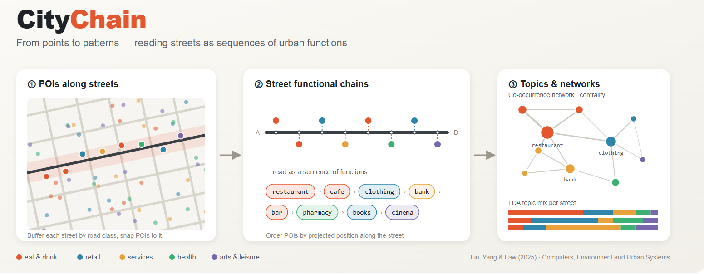

<p align="center">
  
</p>

<p align="center">
  <a href="https://doi.org/10.1016/j.compenvurbsys.2024.102246"></a>
  
  <a href="LICENSE"></a>
  <a href="https://overturemaps.org/"></a>
</p>

# CityChain

**Street-level POI chain analysis of urban functional structure**

cityChain turns scattered Points of Interest (POIs) into ordered *functional chains* along streets. It treats each chain as a short "sentence" of urban functions, then studies those sentences with network analysis, sequential pattern mining and LDA topic modelling. The result is a street-level picture of how urban functions sit next to each other and link up across a city.

The method comes from our paper in *Computers, Environment and Urban Systems*:

> Lin, X., Yang, T., & Law, S. (2025). From points to patterns: An explorative POI network study on urban functional distribution. *Computers, Environment and Urban Systems*, 117, 102246. https://doi.org/10.1016/j.compenvurbsys.2024.102246

This repository applies that pipeline to many cities at once, using open data from [Overture Maps](https://overturemaps.org/). Sample data for four cities (Amsterdam, Bordeaux, Cambridge UK and Kochi) is included, so you can run everything straight after cloning.

---

## How it works

```
Overture Maps (places + road segments)
        │  01_download_data.py   download per-city GeoParquet
        │  02_clip_data.py       keep road-type segments inside the city bbox
        ▼
Street functional chains
        │  03_generate_chains.py buffer roads by class, snap POIs, order them along the street
        ▼
City-level analysis
        │  04_analyze_cities.py  ├─ category co-occurrence network (centralities, density, …)
        │                        ├─ repeated sequential patterns (length 3–10)
        │                        └─ LDA topic model (6 topics) + per-street topic map
        ▼
Visualisation & cross-city analysis
           05_visualize_map.py         topic maps and top-term bar charts
           06_detailed_analysis_cities.py
                                       pattern counts, distribution normalisation,
                                       decay-curve fitting, pattern→topic decoding,
                                       cross-topic patterns
```

**Chain extraction (step 3).** Each road segment gets a buffer whose width depends on its class (motorway 200 m, trunk 150 m, primary 100 m, secondary 75 m, tertiary 50 m, service 30 m, residential 25 m, living street and pedestrian 15 m, anything else 50 m). A POI is joined to every buffer that contains it and then projected onto the street centreline. Its position along the street decides its place in the chain. Geometry is projected to the city's local UTM zone, which is detected automatically, so buffer widths are true metres.

**Taxonomy.** POI categories are mapped onto the Overture category hierarchy (`data/input/overture_categories.csv`). The analysis runs at hierarchy level 2 by default.

---

## Repository structure

```
.
├── data/
│   └── input/
│       ├── overture_categories.csv        # Overture category → hierarchy lookup
│       └── city/<city>/                   # sample data for 4 cities
│           ├── <city>_place.geoparquet
│           ├── <city>_segment.geoparquet
│           └── <city>_segments_clipped.geoparquet
├── docs/                              # README figures
├── scripts/
│   ├── main_pipeline.py                   # runs steps 3–6 in one go
│   ├── cities.py                          # study cities + bounding boxes
│   ├── 01_download_data.py
│   ├── 02_clip_data.py
│   ├── 03_generate_chains.py
│   ├── 04_analyze_cities.py
│   ├── 05_visualize_map.py
│   ├── 06_detailed_analysis_cities.py
│   ├── network_analysis.py                # category network + report
│   ├── pattern_mining.py                  # sequential pattern mining
│   ├── topic_modeling.py                  # LDA topic modelling
│   └── detailed_*.py                      # modules used by step 6
├── requirements.txt
├── CITATION.cff
└── LICENSE
```

`data/output/` is created when you run the pipeline. It is not tracked by git.

---

## Installation

You need Python 3.10 or newer.

```bash
git clone https://github.com/alphonse-lin/cityChain.git
cd cityChain

python -m venv .venv
source .venv/bin/activate        # Windows: .venv\Scripts\activate
pip install -r requirements.txt

# Optional: only needed to download new cities (step 1)
pip install overturemaps
```

On Windows, if `pip` fails to install `geopandas`, install it from conda-forge instead: `conda install -c conda-forge geopandas pyarrow`.

---

## Quick start

Run every command from the repository root. All paths are relative to it.

```bash
python scripts/main_pipeline.py
```

This runs steps 3–6 on every city folder in `data/input/city/`. For the two smaller sample cities, the whole run takes about 2–3 minutes on a laptop. Amsterdam is the largest sample and takes the longest.

## Running steps individually

| Step | Command | Output |
|---|---|---|
| 1. Download | `python scripts/01_download_data.py [city ...]` | `data/input/city/<city>/<city>_{place,segment}.geoparquet` |
| 2. Clip | `python scripts/02_clip_data.py` | `data/input/city/<city>/<city>_segments_clipped.geoparquet` |
| 3. Chains | `python scripts/03_generate_chains.py` | `data/output/chainRawData/<city>/<city>_road_text_chain.{csv,geojson}` |
| 4. Analysis | `python scripts/04_analyze_cities.py` | `data/output/chainAnalysisData/<city>/…` |
| 5. Maps | `python scripts/05_visualize_map.py` | `data/output/chainPlotMap/<city>/*.png` |
| 6. Detailed | `python scripts/06_detailed_analysis_cities.py` | `data/output/analysisResults/…` |

### Adding a new city

1. Add an entry to `scripts/cities.py`, for example `"lisbon": {"name": "Lisbon", "bbox": (min_lon, min_lat, max_lon, max_lat)}`.
2. Run `python scripts/01_download_data.py lisbon`, then `python scripts/02_clip_data.py`.
3. Run `python scripts/main_pipeline.py`.

`cities.py` already lists the bounding boxes for 40 cities across Asia, Europe, the Americas and Africa.

### Key parameters

| Parameter | Where | Default |
|---|---|---|
| Buffer width per road class | `BUFFER_WIDTHS` in `03_generate_chains.py` | see above |
| Taxonomy level | `TAXONOMY_LEVEL` in `main_pipeline.py` | `2` |
| Number of LDA topics | `optimal_topics` in `04_analyze_cities.py` | `6` |
| Pattern length / min. frequency | `analyze_poi_patterns_with_taxonomy(...)` in `04_analyze_cities.py` | 3–10 / 2 |
| LDA passes / random seed | `train_lda` in `topic_modeling.py` | 20 / 42 |

To choose the number of topics from the data, uncomment the `analyze_optimal_topics` block in `04_analyze_cities.py`. It plots coherence and perplexity for 2–9 topics.

---

## Main outputs

| File | Content |
|---|---|
| `<city>_road_text_chain.geojson` | One feature per street, with the ordered POI names and categories (`\|`-separated) |
| `network_report_level_2.txt`, `category_network_level_2.graphml` | Category co-occurrence network: top degree, betweenness and closeness nodes, density, clustering, assortativity |
| `poi_pattern_analysis_level_2.txt` | Repeated sequential patterns of length 3–10, with frequency and coverage |
| `lda_results_*.txt`, `models_2/` | LDA topic–term distributions, coherence (c_v), perplexity, saved model |
| `topicmodelling_2/*.csv` | Topic terms, POI-to-POI connections, topic-to-topic interactions |
| `spatial_visualization_2/road_topics_2.geojson` | Per-street topic probabilities and dominant topic, ready for GIS |
| `analysisResults/chainPattern/` | Cross-city pattern counts, normalised distributions, correlation heatmap, decay-curve fits |
| `analysisResults/<city>/` | Pattern → topic decoding (xlsx) and cross-topic pattern report |

---

## Data and licensing

- **Code:** GNU General Public License v3.0 (see [LICENSE](LICENSE)).
- **Sample data** in `data/input/city/` comes from Overture Maps and keeps its original licences. Places are © Overture Maps Foundation under [CDLA Permissive 2.0](https://cdla.dev/permissive-2-0/). Transportation segments are under [ODbL](https://opendatacommons.org/licenses/odbl/) and include © OpenStreetMap contributors. See Overture's [attribution guidance](https://docs.overturemaps.org/attribution/) before redistributing derived data.
- Overture releases change over time, so newly downloaded data can differ slightly from the bundled samples.

## Notes

- Earlier internal versions projected every city to EPSG:32650 (UTM 50N). The code now uses each city's own UTM zone. Chain counts can therefore differ slightly from runs made with the older code.
- `network_analysis.py` reports network diameter and average path length. Both need a connected category network. This holds for the sample cities, but it may fail for very small study areas.

---

## Citation

If you use this code or method, please cite:

```bibtex
@article{lin2025points,
  title   = {From points to patterns: An explorative POI network study on urban functional distribution},
  author  = {Lin, Xuhui and Yang, Tao and Law, Stephen},
  journal = {Computers, Environment and Urban Systems},
  volume  = {117},
  pages   = {102246},
  year    = {2025},
  doi     = {10.1016/j.compenvurbsys.2024.102246}
}
```

GitHub's "Cite this repository" button reads the same information from `CITATION.cff`.

## Contributing

Issues and pull requests are welcome, whether they are bug reports, new cities or method extensions.
